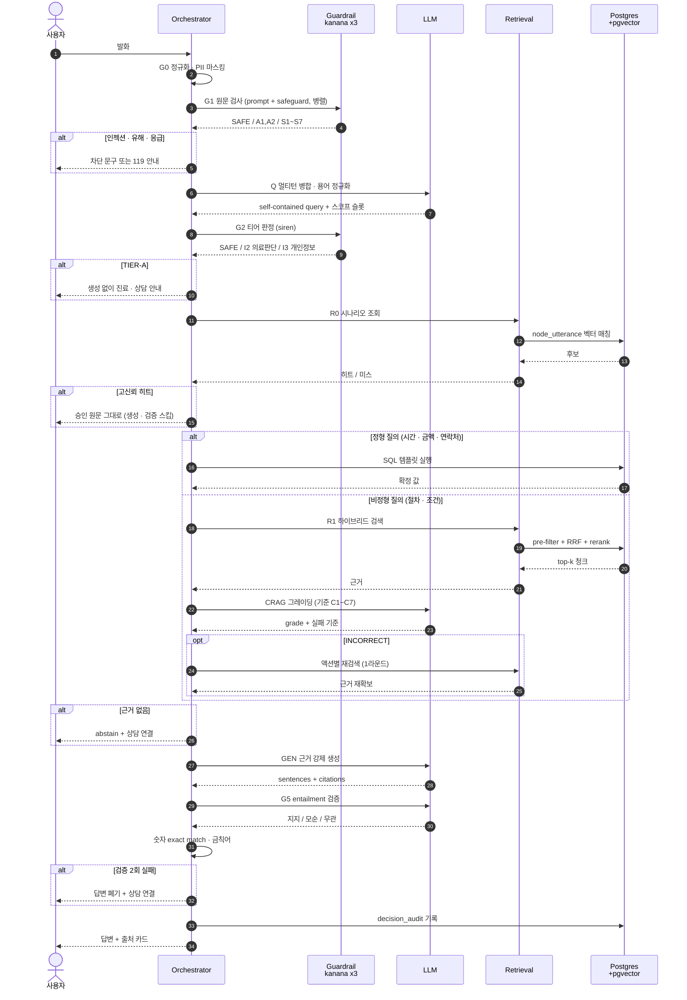
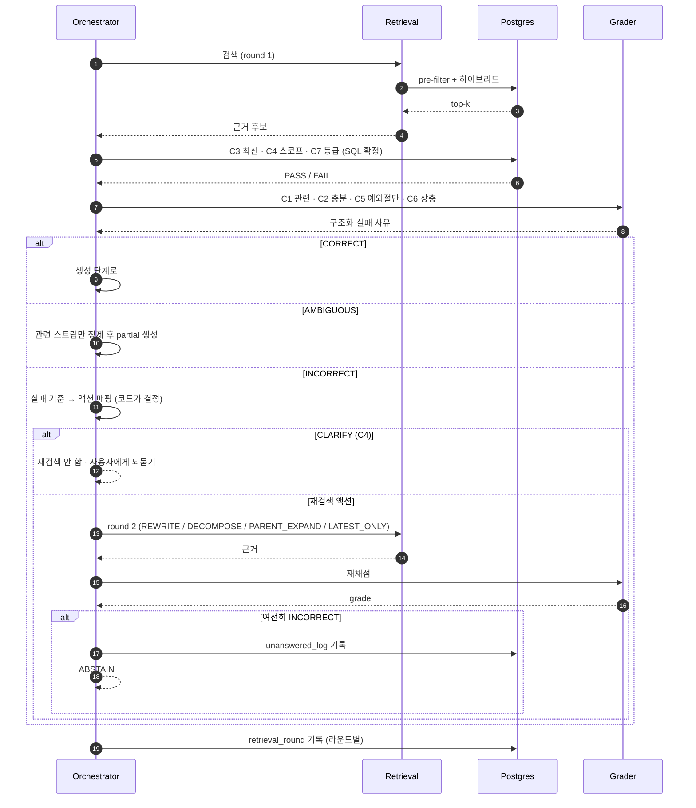
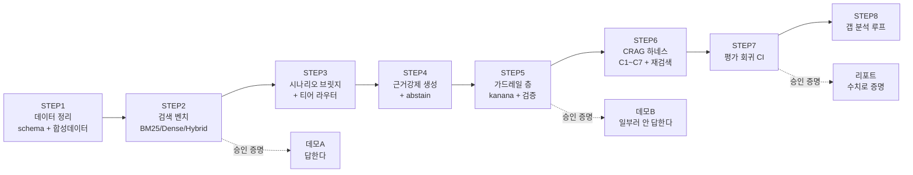

# 10. 시퀀스 다이어그램

## 1. 런타임 한 턴 (전체 경로)

조기 종료(`alt` 블록)를 만나면 그 아래는 실행되지 않는다.

```mermaid
sequenceDiagram
    autonumber
    actor U as 사용자
    participant ORC as Orchestrator
    participant GRD as Guardrail<br/>kanana x3
    participant LLM as LLM
    participant RET as Retrieval
    participant PG as Postgres<br/>+pgvector

    U->>ORC: 발화
    ORC->>ORC: G0 정규화 · PII 마스킹

    ORC->>GRD: G1 원문 검사 (prompt + safeguard, 병렬)
    GRD-->>ORC: SAFE / A1,A2 / S1~S7
    alt 인젝션 · 유해 · 응급
        ORC-->>U: 차단 문구 또는 119 안내
    end

    ORC->>LLM: Q 멀티턴 병합 · 용어 정규화
    LLM-->>ORC: self-contained query + 스코프 슬롯

    ORC->>GRD: G2 티어 판정 (siren)
    GRD-->>ORC: SAFE / I2 의료판단 / I3 개인정보
    alt TIER-A
        ORC-->>U: 생성 없이 진료 · 상담 안내
    end

    ORC->>RET: R0 시나리오 조회
    RET->>PG: node_utterance 벡터 매칭
    PG-->>RET: 후보
    RET-->>ORC: 히트 / 미스
    alt 고신뢰 히트
        ORC-->>U: 승인 원문 그대로 (생성 · 검증 스킵)
    end

    alt 정형 질의 (시간 · 금액 · 연락처)
        ORC->>PG: SQL 템플릿 실행
        PG-->>ORC: 확정 값
    else 비정형 질의 (절차 · 조건)
        ORC->>RET: R1 하이브리드 검색
        RET->>PG: pre-filter + RRF + rerank
        PG-->>RET: top-k 청크
        RET-->>ORC: 근거
        ORC->>LLM: CRAG 그레이딩 (기준 C1~C7)
        LLM-->>ORC: grade + 실패 기준
        opt INCORRECT
            ORC->>RET: 액션별 재검색 (1라운드)
            RET-->>ORC: 근거 재확보
        end
    end
    alt 근거 없음
        ORC-->>U: abstain + 상담 연결
    end

    ORC->>LLM: GEN 근거 강제 생성
    LLM-->>ORC: sentences + citations
    ORC->>LLM: G5 entailment 검증
    LLM-->>ORC: 지지 / 모순 / 무관
    ORC->>ORC: 숫자 exact match · 금칙어
    alt 검증 2회 실패
        ORC-->>U: 답변 폐기 + 상담 연결
    end

    ORC->>PG: decision_audit 기록
    ORC-->>U: 답변 + 출처 카드
```

---

## 2. CRAG 재검색 루프

```mermaid
sequenceDiagram
    autonumber
    participant ORC as Orchestrator
    participant RET as Retrieval
    participant PG as Postgres
    participant GRD as Grader

    ORC->>RET: 검색 (round 1)
    RET->>PG: pre-filter + 하이브리드
    PG-->>RET: top-k
    RET-->>ORC: 근거 후보

    ORC->>PG: C3 최신 · C4 스코프 · C7 등급 (SQL 확정)
    PG-->>ORC: PASS / FAIL
    ORC->>GRD: C1 관련 · C2 충분 · C5 예외절단 · C6 상충
    GRD-->>ORC: 구조화 실패 사유

    alt CORRECT
        ORC->>ORC: 생성 단계로
    else AMBIGUOUS
        ORC->>ORC: 관련 스트립만 정제 후 partial 생성
    else INCORRECT
        ORC->>ORC: 실패 기준 → 액션 매핑 (코드가 결정)
        alt CLARIFY (C4)
            ORC-->>ORC: 재검색 안 함 · 사용자에게 되묻기
        else 재검색 액션
            ORC->>RET: round 2 (REWRITE / DECOMPOSE / PARENT_EXPAND / LATEST_ONLY)
            RET-->>ORC: 근거
            ORC->>GRD: 재채점
            GRD-->>ORC: grade
            alt 여전히 INCORRECT
                ORC->>PG: unanswered_log 기록
                ORC-->>ORC: ABSTAIN
            end
        end
    end
    ORC->>PG: retrieval_round 기록 (라운드별)
```

---

## 3. 개발 순서 (STEP 흐름)

```mermaid
flowchart LR
    S1["STEP1<br/>데이터 정리<br/>schema + 합성데이터"] --> S2["STEP2<br/>검색 벤치<br/>BM25/Dense/Hybrid"]
    S2 --> S3["STEP3<br/>시나리오 브릿지<br/>+ 티어 라우터"]
    S3 --> S4["STEP4<br/>근거강제 생성<br/>+ abstain"]
    S4 --> S5["STEP5<br/>가드레일 층<br/>kanana + 검증"]
    S5 --> S6["STEP6<br/>CRAG 하네스<br/>C1~C7 + 재검색"]
    S6 --> S7["STEP7<br/>평가 회귀 CI"]
    S7 --> S8["STEP8<br/>갭 분석 루프"]

    S2 -.승인 증명.-> D1["데모A<br/>답한다"]
    S5 -.승인 증명.-> D2["데모B<br/>일부러 안 답한다"]
    S7 -.승인 증명.-> D3["리포트<br/>수치로 증명"]
```

> 발주처 설득의 순서는 `데모B → 데모A → 리포트`다. "안 답하는 것"을 먼저 보여주는 쪽이 논쟁을 끝낸다.
